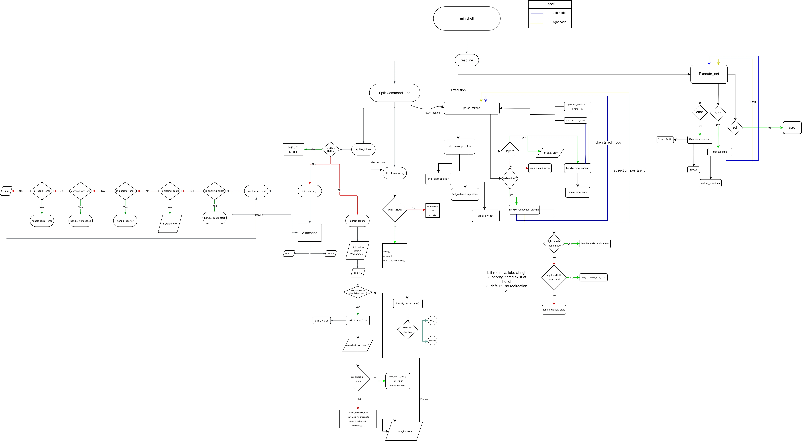
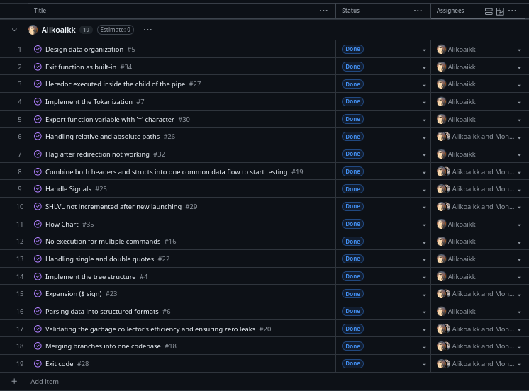
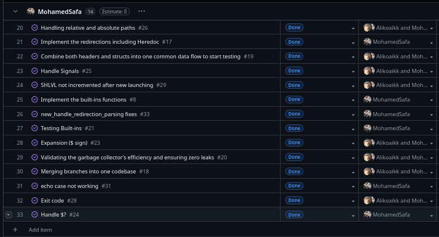

*This project has been created as part of the 42 curriculum by akoaik, msafa.*

# Minishell

## Description

**Minishell** is a Unix shell implementation written in C that mimics the behavior of Bash. The goal of this project is to understand how a shell works under the hood by building one from scratch, covering process creation, file descriptor management, signal handling, and more.

The shell supports:
- Execution of external programs and 7 built-in commands (`echo`, `cd`, `pwd`, `export`, `unset`, `env`, `exit`)
- Pipes (`|`) for chaining commands
- Input/output redirections (`<`, `>`, `>>`) and here-documents (`<<`)
- Single and double quote handling
- Environment variable expansion (`$VAR`, `$?`)
- Signal handling (`Ctrl+C`, `Ctrl+\`, `Ctrl+D`)
- Custom garbage collector for automatic memory management
- Recursive descent parser with Abstract Syntax Tree (AST) for command representation

## Instructions

### Compilation

```bash
make
```

This compiles the `libft` library and the minishell source files, producing a `minishell` executable.

Other available rules:
- `make clean` — remove object files
- `make fclean` — remove object files and the executable
- `make re` — recompile from scratch

### Execution

```bash
./minishell
```

You will be presented with an interactive prompt (`minishell$ `) where you can type commands just like in Bash.

### Usage Examples

```bash
minishell$ echo hello world
hello world

minishell$ ls -la | grep .c | wc -l
48

minishell$ cat << EOF > output.txt
> hello
> world
> EOF

minishell$ export VAR="hello"
minishell$ echo $VAR
hello

minishell$ exit
```

## Resources
- The Bash shell itself
- [Bash Reference Manual (GNU)](https://www.gnu.org/software/bash/manual/bash.html)
- [Linux man pages: fork(2), execve(2), pipe(2), dup2(2), waitpid(2), signal(2)](https://man7.org/linux/man-pages/)
- [Readline Library Documentation](https://tiswww.case.edu/php/chet/readline/rltop.html)

### AI Usage

AI tools (ChatGPT, Claude) were used during the development of this project for:
- Debugging assistance when tracking down edge cases in signal handling and heredoc implementation
- Understanding system call behavior and POSIX standards
- Generating the evaluation summary documentation

---

## Flowchart



---

## Tasks




---

## Authors

| Author | GitHub |
|--------|--------|
| **akoaik** | [github.com/akoaik](https://github.com/alikoaikk) |
| **msafa** | [github.com/msafa](https://github.com/mohamedsafa) |
